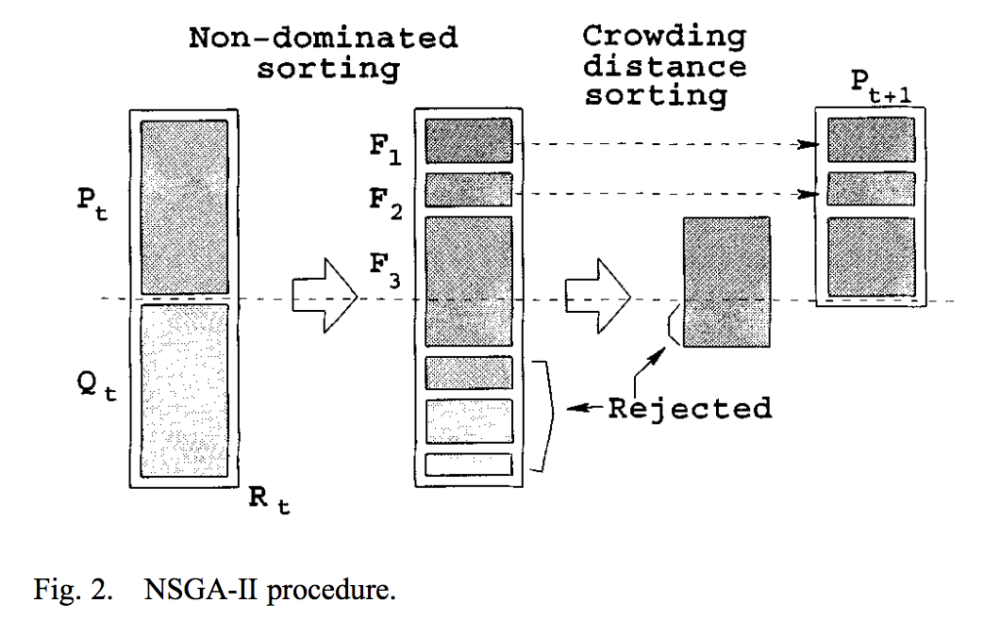
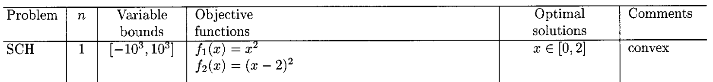

# NSGA-II

NSGA-II (nondominated sorting genetic algorithm II) is one of the Multiobjective evolutionary algorithms. If you want to know the details, please see [this papper](https://www.iitk.ac.in/kangal/Deb_NSGA-II.pdf).  

# This program
I use processing3 (ver 3.3.6). Now I use SCH problems in [this papper](https://www.iitk.ac.in/kangal/Deb_NSGA-II.pdf).  
SCH :  

# Parameter
There are some parameter.
- final int population_size = 100;  
  you can change poplulation size. Please keep
- final int num_of_object = 2;  
  Thos represent number of object to optimize. In SCH, There are 2 functions. So I initialized this variable with 2.
- final int mutation_prob = 8;  
  This is probability of mutation. Now probability is 8/10.
- final int x_num = 1;  
  This is number of x.
- final double x_min = -1000.0d;
- final double x_max = 1000.0d;  
  These are variable bounds.
- final int zoom = 100;
  It should be 1, 5, 10, 50, 100.

# Reference paper
**A Fast and Elitist Multiobjective Genetic Algorithm:
NSGA-II**  
Kalyanmoy Deb, Associate Member, IEEE, Amrit Pratap, Sameer Agarwal, and T. Meyarivan  
IEEE TRANSACTIONS ON EVOLUTIONARY COMPUTATION, VOL. 6, NO. 2, APRIL 2002
